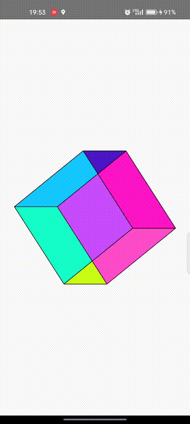

# 🎨 Rotating 3D Cube with Jetpack Compose

This project is a simple 3D rotating cube animation built using **Jetpack Compose** for Android. It’s a tribute to the early days of coding, drawing inspiration from the "demo scene" of the Commodore Amiga, where programmers combined art, music, and code to push the limits of hardware.

## 🚀 Getting Started

### Prerequisites

To run this project, you'll need:

- **Android Studio** (Arctic Fox or newer)
- **Kotlin** (1.5+)
- **Jetpack Compose** (1.0+)

### Installation

1. Clone the repository:
    \`\`\`bash
    git clone https://github.com/your-username/rotating-cube.git
    \`\`\`
2. Open the project in **Android Studio**.
3. Build and run the app on your emulator or physical device.

### Running the App

The app will display a simple rotating 3D cube that changes its rotation along the X and Y axes. It uses Jetpack Compose's animation APIs to create a smooth, continuous rotation.

## 🖼️ Screenshots

## 📄 Code Overview

- **`MainActivity.kt`**: The entry point of the app where the cube is rendered using Jetpack Compose.
- **`RotatingCube()`**: The Composable function responsible for drawing the cube and managing its rotation.
- **`Point3D.kt`**: A utility class that handles 3D transformations like rotating points along the X and Y axes.

### Core Features:
- 3D rotation of a cube using Kotlin.
- Use of **Jetpack Compose's Canvas API** to render 2D graphics.
- Infinite animation using Compose's **`rememberInfiniteTransition`** for smooth rotation.
- Colorful cube faces and drawn edges for better visual representation.

## 🎨 Demo Scene Inspiration

This project draws inspiration from the **Commodore Amiga demo scene**, where enthusiasts created multimedia demos showcasing what the hardware could do. While this app is simpler, it captures the spirit of merging creativity with technical skill.

## 💡 Future Improvements

- Add more 3D objects and camera perspectives.
- Implement lighting and shading to give the cube a more realistic appearance.
- Include user interaction, allowing control of the cube's rotation.

## 🤝 Contributing

Contributions are welcome! Feel free to fork the repository and submit a pull request with your enhancements or bug fixes.

## 📄 License

This project is licensed under the MIT License - see the [LICENSE](LICENSE) file for details.

